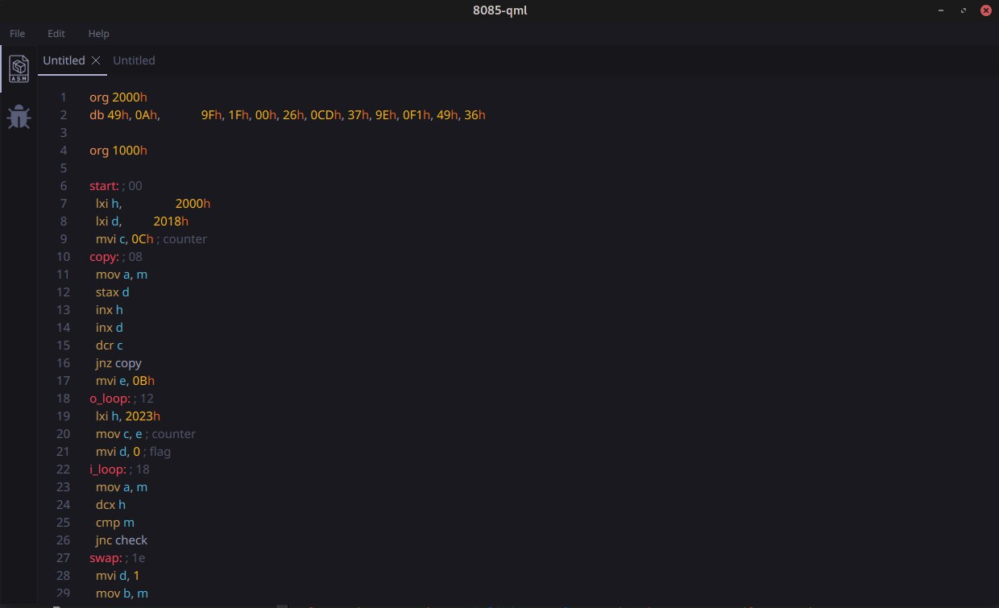
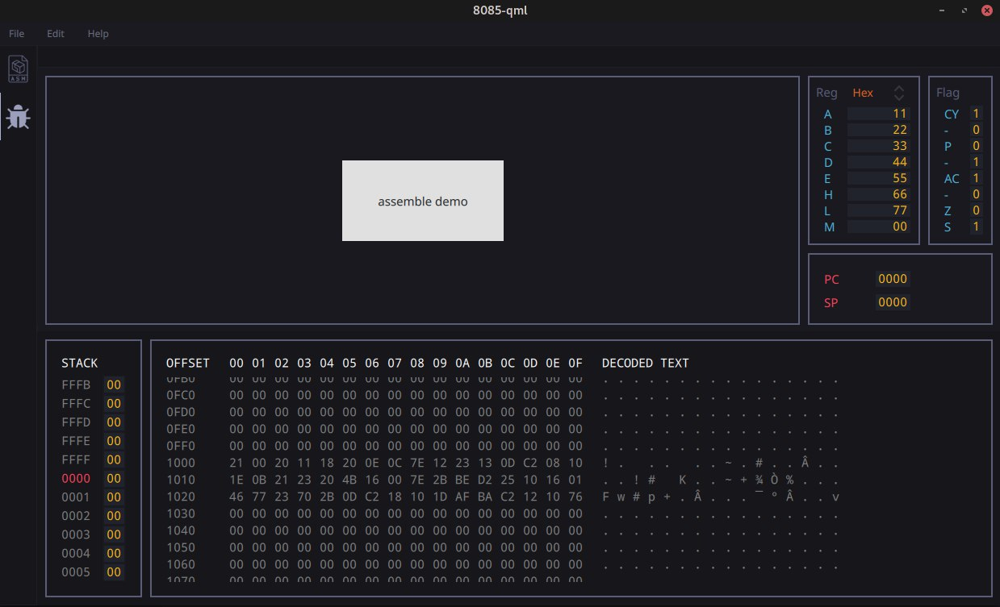

# 8085

This is an attempt to implement Intel 8085 processor simulator in C++ using Qt Framework. For now app consists of 2 
windows - editor, where multiple source files can be edited, and debugger, where all the memory, stack and register data are shown.

**Work-in-Progress**

## GUI demo

## TODO
- [ ] Write disassembler part
- [ ] Finish debugger window (mnemonics and control bar)
- [ ] Finish code editor window (needs document handler)
- [ ] Rewrite handling of app Settings
